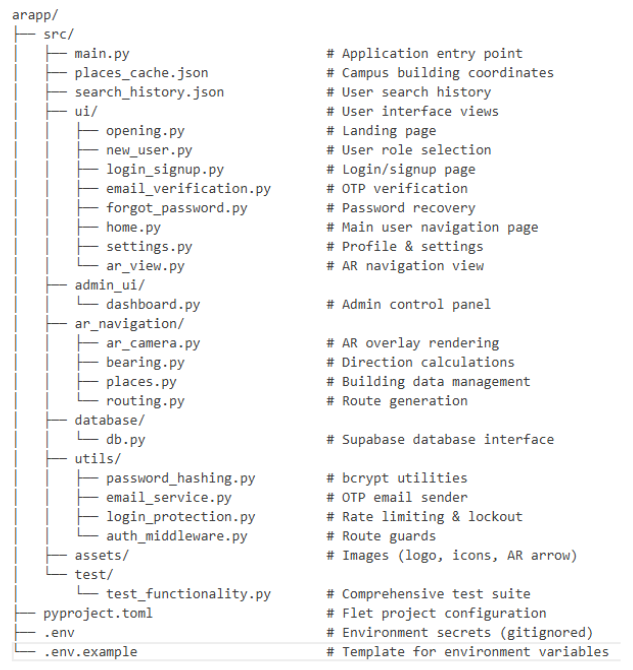
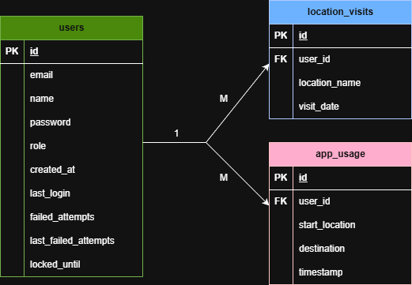

# SARI NA - Project Documentation

## 1. Project Overview & Problem Statement

### 1.1 Project Summary

**SARI NA? (Smart Augmented Reality Interactive Navigation App)** is a cross-platform application built using the Flet framework. It helps new students navigate the CSPC campus using an AR-assisted guidance system paired with an interactive map and navigation features.

The app aims to solve a common problem among freshmen: difficulty finding buildings, rooms, and facilities inside CSPC, especially during the first weeks of the semester.

Our solution uses a mix of:

- Flet-based cross-platform UI
- AR-simulated wayfinding with directional overlays
- Campus building database (JSON-based places cache)
- Real-time route guidance and navigation
- User authentication and role-based access control
- Persistent search history

The name **"SARI NA?"** is inspired by Filipino slang "saan na?" (Where is it?) and is a playful, inviting acronym for **Smart Augmented Reality Interactive Navigation App**.

### 1.2 Problem Statement

Meet Jake, a freshman at CSPC. Jake doesn't know where Academic Building 5 is. He's too shy to ask guards or other students. Many of us were "Jake" during our early college days — lost, unsure, and overwhelmed.

The campus is large, buildings can be confusing, and finding the right room on time is a challenge for new students.

**SARI NA?** solves this problem by providing a simple guidance system that helps any student:

- Search for campus destinations
- View building information and directions
- Navigate the campus with AR-assisted directional arrows
- Save search history for quick access to frequently visited locations

### 1.3 Target Users

- **New CSPC students** (freshmen, transferees)
- **Visitors and parents** during campus events
- **Students** navigating new or unfamiliar buildings
- **Anyone** who needs quick building identification and navigation assistance

---

## 2. Feature List and Scope Table

### 2.1 Core Features

| Feature                   | Description                                                          | Status         |
| ------------------------- | -------------------------------------------------------------------- | -------------- |
| User Authentication       | Secure login/signup with bcrypt hashing and email OTP verification   | ✅ Implemented |
| Role-Based Access Control | Admin, CSPCean, Visitor roles with different privileges              | ✅ Implemented |
| Search Navigation         | Text-based destination search with building coordinates              | ✅ Implemented |
| AR Navigation View        | Real-time AR overlay with directional arrows and distance indicators | ✅ Implemented |
| Route Calculation         | Bearing-based navigation with turn-by-turn guidance                  | ✅ Implemented |
| Search History            | Persistent local storage of recent searches                          | ✅ Implemented |
| Admin Dashboard           | User management, analytics, role updates, user deletion              | ✅ Implemented |
| Cloud Database            | User data stored in Supabase PostgreSQL                              | ✅ Implemented |

---

## 3. System Architecture

### 3.1 Technology Stack

**Frontend:**

- **Flet 0.28.3** - Python-based UI framework with Flutter rendering engine
- Cross-platform support (Desktop, Web, Android, iOS)
- **OpenCV** - Camera integration

**Backend:**

- **Supabase PostgreSQL** - Cloud database for user management
- **Custom Authentication** - bcrypt password hashing, OTP email verification
- **OpenStreetMap** - Navigation and routing data

**Security:**

- **bcrypt** - Password hashing
- **python-dotenv** - Environment variable management
- **Gmail SMTP** - Email delivery for OTP verification

**Data Storage:**

- **Supabase** - Cloud database (users table)
- **Local JSON** - places_cache.json, search_history.json

### 3.2 Project Structure

## 

## 4. Data Model

### 4.1 Database Schema

**users table:**

```sql
CREATE TABLE users (
    id SERIAL PRIMARY KEY,
    email VARCHAR(255) UNIQUE NOT NULL,
    name VARCHAR(255) NOT NULL,
    password VARCHAR(255) NOT NULL,  -- bcrypt hashed
    role VARCHAR(50) DEFAULT 'CSPCean',  -- Admin, CSPCean, Visitor
    created_at TIMESTAMP DEFAULT NOW(),
    last_login TIMESTAMP,
    failed_attempts INTEGER DEFAULT 0,
    last_failed_attempt TIMESTAMP,
    locked_until TIMESTAMP
);
```

**location_visits table:**

```sql
CREATE TABLE location_visits (
    id SERIAL PRIMARY KEY,
    user_id INTEGER REFERENCES users(id) ON DELETE CASCADE,
    location_name VARCHAR(255) NOT NULL,
    visit_date TIMESTAMP DEFAULT NOW()
);
```

**app_usage table:**

```sql
CREATE TABLE app_usage (
    id SERIAL PRIMARY KEY,
    user_id INTEGER REFERENCES users(id) ON DELETE CASCADE,
    start_location TEXT NOT NULL,
    destination TEXT NOT NULL,
    timestamp TIMESTAMPTZ DEFAULT NOW()
);

```

### 4.2 ERD Diagram



### 4.3 JSON Data Files

`places_cache.json` - Campus building coordinates:

```json
{
  "name": "Academic Building 5",
  "latitude": 13.580123,
  "longitude": 123.23145,
  "description": "AB5 building used for IT and CS courses."
}
```

`search_history.json` - User search history:

```json
[
  {
    "query": "Academic Building 5",
    "timestamp": "2025-12-08T10:30:00"
  }
]
```

---

## 5. Emerging Technology Content

### 5.1 Emerging Technologies Used

#### 1. **Augmented Reality (AR) Simulation**

The app uses a custom AR simulation built on top of mathematical bearings, screen projection, and dynamic overlays. Although not full ARCore/ARKit, it recreates AR-like behavior suitable for desktop and cross-platform environments.

**How it works:**

- User's current location and destination coordinates are processed
- Bearing calculations determine the direction to the target
- AR overlays (arrows, labels, distance) are rendered on simulated camera feed
- Real-time updates as user's heading changes

#### 2. **Flet Framework (Python + Flutter Rendering)**

Flet acts as the emerging technology responsible for:

- **Cross-platform UI rendering** (desktop, web, mobile APK)
- **Real-time reactive UI updates** without page refreshes
- **Canvas-based graphics** for AR overlays and custom drawing
- **Seamless integration** of Python logic with Flutter's rendering engine

This allows the project to implement AR-style visuals, routing, and interactive components entirely with Python, without requiring native mobile SDKs.

#### 3. **Geospatial Computation Modules**

The app uses mathematical models for:

- **Bearing calculation** - Azimuth angles between user and destination
- **Distance calculation** - Haversine formula for great-circle distance
- **Directional mapping** - Converting geographic bearings to screen coordinates

**Modules involved:**

- `bearing.py` - Calculates compass bearing between two GPS coordinates
- `places.py` - Manages campus building data and coordinates
- `routing.py` - Generates navigation routes with waypoints
- `ar_camera.py` - Renders AR overlays on simulated camera feed

#### 4. **Cloud-Based Authentication with Security Best Practices**

- **Supabase PostgreSQL** - Scalable cloud database
- **bcrypt password hashing** - Industry-standard credential protection
- **OTP email verification** - Prevents fake account creation
- **Rate limiting & account lockout** - Protects against credential stuffing attacks
- **Role-based access control** - Admin, CSPCean, Visitor permissions

### 5.2 AR Navigation Workflow

```
1. User opens AR View page
   ↓
2. System loads simulated camera interface with AR overlays
   ↓
3. Building coordinates retrieved from places_cache.json
   ↓
4. User's current position and heading processed
   ↓
5. bearing.py calculates angles between user and target
   ↓
6. ar_camera.py maps calculations to screen coordinates
   ↓
7. AR overlays (arrows, labels, distance) rendered in real-time
   ↓
8. User sees directional guidance pointing toward destination
```

### 5.3 Limitations

**Flet-Related Limitations:**

- No direct access to device camera feeds (AR simulated with static background)
- Limited mobile sensor APIs (compass, GPS, gyroscope)
- Experimental mobile build support

**AR Simulation Constraints:**

- Not a full AR system (no SLAM or depth detection)
- No real positional tracking (simulated GPS coordinates)
- Accuracy depends on predefined building coordinates

**Platform Constraints:**

- Desktop devices lack orientation sensors
- Mobile APK builds may behave inconsistently
- Network required for authentication and email verification

---

## 6. Role Capabilities

### 6.1 Role Capabilities Table

| Capability               | CSPCean | Visitor | Admin |
| ------------------------ | ------- | ------- | ----- |
| User Authentication      | ✅      | ✅      | ✅    |
| View Home Page           | ✅      | ✅      | ❌    |
| Search Campus Locations  | ✅      | ✅      | ❌    |
| AR Navigation            | ✅      | ✅      | ❌    |
| Change Password          | ✅      | ✅      | ✅    |
| View Profile             | ✅      | ✅      | ✅    |
| Admin Dashboard          | ❌      | ❌      | ✅    |
| User Management          | ❌      | ❌      | ✅    |
| View Analytics & Reports | ❌      | ❌      | ✅    |
| Delete Users             | ❌      | ❌      | ✅    |
| Update User Roles        | ❌      | ❌      | ✅    |

---

## 7. Security Features

### 7.1 Security Features Table

| Feature                                | Description                                                             | Status         |
| -------------------------------------- | ----------------------------------------------------------------------- | -------------- |
| User Authentication                    | Secure login/logout with email/password validation, session clearing    | ✅ Implemented |
| Password Hashing                       | Using bcrypt for password hashing on signup, verification, reset/change | ✅ Implemented |
| Protection against Credential Stuffing | 5-minute lockout after failed attempts                                  | ✅ Implemented |
| Role-Based Access Control (RBAC)       | Admin, CSPCean, Visitor roles with UI and server-side enforcement       | ✅ Implemented |
| User Management (Admin only)           | List, delete, create users with roles                                   | ✅ Implemented |
| Profile Management                     | View and change password with rules                                     | ✅ Implemented |
| Data Layer                             | Supabase PostgreSQL database                                            | ✅ Implemented |
| Secure Configuration                   | Secrets in .env file, not hard-coded, .env.example provided             | ✅ Implemented |
| Two-Factor Authentication              | Email OTP support                                                       | ✅ Implemented |
| User Activity Monitoring               | Tracking last login and failed attempts                                 | ✅ Implemented |
| Reporting & Analytics                  | Charts for usage and role distribution (admin dashboard)                | ✅ Implemented |
| Secure Password Reset                  | Signed time-bound token email flow (forgot password and settings)       | ✅ Implemented |

---

## 8. Installation and Setup

### 8.1 Prerequisites

- Python 3.9 or higher
- Supabase account (free tier: https://supabase.com)
- Gmail account with App Password enabled

### 8.2 Installation Steps

**1. Clone the repository:**

```bash
git clone https://github.com/johncarlonas/cccs106-projects.git
cd cccs106-projects/final_project/arapp
```

**2. Install dependencies:**

```bash
pip install flet==0.28.3
pip install supabase
pip install python-dotenv
pip install bcrypt
```

Or using the pyproject.toml:

```bash
flet pack
```

**3. Configure environment variables:**

Copy `.env.example` to `.env`:

```bash
copy .env.example .env
```

Edit `.env` with your credentials:

```env
SUPABASE_URL=https://your-project.supabase.co
SUPABASE_KEY=your-anon-key-here
SENDER_EMAIL=your-gmail@gmail.com
SENDER_PASSWORD=your-gmail-app-password
```

**4. Set up Supabase database:**

Create a table in Supabase SQL Editor:

```sql
REFER TO SECTION 4.1 FOR SCHEMA
```

**5. Run the application:**

```bash
cd src
flet run
```

Or from project root:

```bash
flet run arapp/src
```

**7. Build APK (optional):**

```bash
flet build apk
```

---

## 9. Testing Summary

### 9.1 Test Suite Overview

The project includes a comprehensive test suite (`test_functionality.py`) with **39 tests** across **13 test suites**, achieving **87.2% pass rate** (34/39 passing).

**Test Coverage:**

- ✅ Database connection (Supabase)
- ✅ Password hashing (bcrypt)
- ✅ User authentication (login, logout)
- ✅ Role-based access control (Admin, CSPCean, Visitor)
- ✅ Credential stuffing protection (rate limiting, lockout)
- ✅ Profile management (edit name, change password)
- ✅ Admin user management (list, delete, update roles)
- ✅ Email & OTP verification
- ✅ Error handling (email validation, password complexity)
- ✅ Search functionality

### 9.2 How to Run Tests

**Run all tests:**

```bash
cd src
python test/test_functionality.py
```

### 9.3 Manual Testing Checklist

- [ ] Create new user account with OTP verification
- [ ] Login with correct credentials
- [ ] Test "Remember Me" functionality
- [ ] Trigger rate limiting (6 failed login attempts)
- [ ] Trigger account lockout (10 failed attempts)
- [ ] Reset password via "Forgot Password"
- [ ] Edit profile name and change password
- [ ] Admin: View dashboard analytics
- [ ] Admin: Update user roles
- [ ] Admin: Delete user account
- [ ] Search for campus building
- [ ] View AR navigation with directional arrows
- [ ] Check search history persistence
- [ ] Test logout and session clearing

---

## 10. Team Roles

| Member                         | Role                                   | Responsibilities                                                           |
| ------------------------------ | -------------------------------------- | -------------------------------------------------------------------------- |
| **Nas, John Carlo E.**         | Full Stack Developer / Project Manager | UI/UX design, database design, authentication system, project coordination |
| **Montenegro, John Renzzo C.** | AR/Navigation Developer                | AR overlay rendering, navigation algorithms, route calculation             |
| **Malanon, Remar F.**          | QA Tester and Documentation Manager    | Testing and quality assurance, documentation writing, project reporting    |

---

## 11. Risks and Constraints

### 11.1 Technical Constraints

- **No real-time GPS** - AR navigation is simulated with predefined coordinates
- **Flet camera limitations** - No access to device camera feed (AR uses static background)
- **JSON coordinate accuracy** - Navigation precision depends on manually entered building locations
- **Desktop-oriented** - Mobile APK builds are experimental and may have inconsistencies
- **Network dependency** - Authentication and email verification require internet connection

### 11.2 Known Risks

- **Incorrect building coordinates** - May result in wrong AR directional overlays
- **Email delivery failures** - OTP emails may fail on unstable internet or Gmail rate limits
- **Bearing calculation assumptions** - Requires user orientation data (simulated on desktop)
- **APK build performance** - bcrypt and supabase dependencies increase build time (15-30 minutes)

### 11.3 Mitigation Strategies

- Validate building coordinates with campus maps before deployment
- Implement email retry logic and error handling for OTP delivery
- Provide fallback navigation mode without AR overlays
- Optimize APK build with minimal dependencies and code obfuscation
- Test thoroughly on multiple Android devices before release

---

## 12. Future Enhancements

### 12.1 Short-Term Improvements

- [ ] Real-time GPS integration for accurate user positioning
- [ ] Device camera feed integration for true AR experience
- [ ] Voice navigation with text-to-speech directions
- [ ] Map-based view with building pins and route visualization
- [ ] Session timeout after inactivity
- [ ] Comprehensive logging and audit trail for admin actions
- [ ] Profile picture upload and display

### 12.2 Long-Term Vision

- [ ] Port to native Android with ARCore support
- [ ] iOS version with ARKit integration
- [ ] 3D campus map with indoor navigation
- [ ] Real-time crowd density and building occupancy
- [ ] Multi-campus support (expansion to other universities)
- [ ] AI-powered chatbot for campus information
- [ ] Integration with class schedules for auto-navigation
- [ ] Social features (share locations, meet up with friends)
- [ ] Accessibility features (screen reader support, high contrast mode)

---

## 13. Conclusion

**SARI NA?** successfully addresses the navigation challenges faced by new students at CSPC by combining modern technologies (Flet, AR simulation, cloud database, secure authentication) into a user-friendly cross-platform application.

The project demonstrates:

- ✅ **Practical problem-solving** - Helping lost students find their way
- ✅ **Emerging tech integration** - AR simulation, Flet framework, cloud database
- ✅ **Security best practices** - bcrypt hashing, OTP verification, rate limiting, RBAC
- ✅ **Professional development** - Modular architecture, comprehensive testing, documentation
- ✅ **Cross-platform capability** - Desktop, web, and mobile (APK) support

While the current implementation has limitations (simulated AR, no real GPS), it serves as a solid proof-of-concept that can be extended with native mobile features in future iterations.

---

## 14. References

- **Flet Documentation:** https://flet.dev/docs
- **Supabase Documentation:** https://supabase.com/docs
- **OpenStreetMap:** https://www.openstreetmap.org
- **bcrypt Documentation:** https://pypi.org/project/bcrypt/
- **Python dotenv:** https://pypi.org/project/python-dotenv/
- **Haversine Formula:** https://en.wikipedia.org/wiki/Haversine_formula
- **Gmail SMTP Setup:** https://support.google.com/accounts/answer/185833

---

**Document Version:** 1.0  
**Last Updated:** December 8, 2025  
**Project Status:** ✅ Completed and Tested

---

## 15. Individual Reflections

### Malanon, Remar F.

---

### Montenegro, John Renzzo C.

---

### Nas, John Carlo E.

Throughout the development of this application, it has been a rollercoaster experience filled with joy, stress, excitement, and moments of burnout. These challenges, however, fueled my motivation to finish the app and pushed me to grow both personally and professionally.

I learned extensively about the Flet framework - its powerful capabilities for cross-platform development, and its limitations that required creative problem-solving. The gaps in Flet's functionality, particularly around camera access and sensor integration, forced us to find innovative substitutes, such as implementing AR simulation through mathematical calculations and screen projections. This experience exposed me deeply to UI/UX design principles, frontend development techniques, and backend technologies.

The process of setting up user management systems, implementing secure authentication, and building comprehensive testing taught me the importance of security best practices and thorough validation in modern applications.

Overall, this has been a transformative experience that solidified my understanding of full-stack development. The satisfaction of seeing SARI NA evolve from concept to a functional navigation app motivates me to continue building and scaling this project. I'm excited about future enhancements like real GPS integration, native camera access, and expanding to multiple campuses. This project has not only taught me technical skills but also the value of perseverance, collaboration, and iterative development in creating meaningful software solutions.

---
